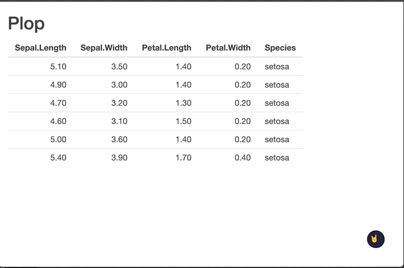

<!-- README.md is generated from README.Rmd. Please edit that file -->

```{r, include = FALSE}
knitr::opts_chunk$set(
  collapse = TRUE,
  comment = "#>",
  fig.path = "man/figures/README-",
  out.width = "100%",
  eval = TRUE
)
```

# darkmode

<!-- badges: start -->
[](https://github.com/ColinFay/darkmode/actions/workflows/R-CMD-check.yaml)
<!-- badges: end -->

The goal of darkmode is to provide a wrapper for [Darkmode.js](https://github.com/sandoche/Darkmode.js) in `{shiny}`.

## Installation

You can install the released version of darkmode from GitHub with

``` r
pak::pak("colinfay/darkmode")
```

## About

You're reading the doc about version : `r pkgload::pkg_version()`

This README has been compiled on the

```{r}
Sys.time()
```

Here are the test & coverage results :

```{r}
devtools::check(quiet = TRUE)
```

```{r echo = FALSE}
unloadNamespace("darkmode")
```

```{r}
covr::package_coverage()
```


## Example

```{r example, eval = FALSE}
library(darkmode)
library(shiny)
ui <- function(request){
  fluidPage(
    with_darkmode(),
    h2("Plop"),
    tableOutput("bing")
  )
}

server <- function(
  input,
  output,
  session
){

  output$bing <- renderTable({
    head(iris)
  })
}

shinyApp(ui, server)
```

You can set parameters for the darkmode:

```{r example2, eval = FALSE}
library(darkmode)
library(shiny)
ui <- function(request){
  fluidPage(
    with_darkmode(label = "🤘"),
    h2("Plop"),
    tableOutput("bing")
  )
}

server <- function(
  input,
  output,
  session
){

  output$bing <- renderTable({
    head(iris)
  })
}

shinyApp(ui, server)
```



