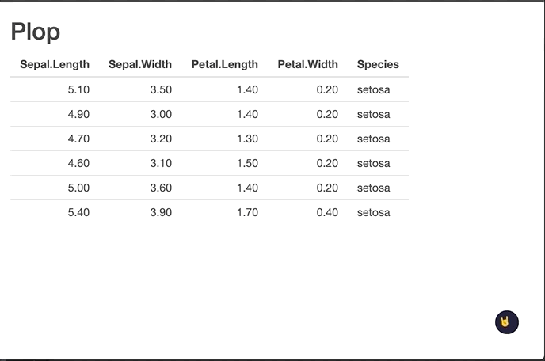

<!-- README.md is generated from README.Rmd. Please edit that file -->

# darkmode

<!-- badges: start -->

<!-- badges: end -->

The goal of darkmode is to provide a wrapper for
[Darkmode.js](https://github.com/sandoche/Darkmode.js) in `{shiny}`.

## Installation

You can install the released version of darkmode from GitHub with

``` r
remotes::install_github("colinfay/darkmode")
```

## Example

This is a basic example which shows you how to solve a common problem:

``` r
library(darkmode)
library(shiny)
ui <- function(request){
  fluidPage(
    with_darkmode(), 
    h2("Plop"), 
    tableOutput("bing")
  )
}

server <- function(
  input, 
  output, 
  session
){

  output$bing <- renderTable({
    head(iris)
  })
}

shinyApp(ui, server)
```

You can set parameters for the darkmode:

``` r
library(darkmode)
library(shiny)
ui <- function(request){
  fluidPage(
    with_darkmode(label = "🤘"),
    h2("Plop"), 
    tableOutput("bing")
  )
}

server <- function(
  input, 
  output, 
  session
){

  output$bing <- renderTable({
    head(iris)
  })
}

shinyApp(ui, server)
```


